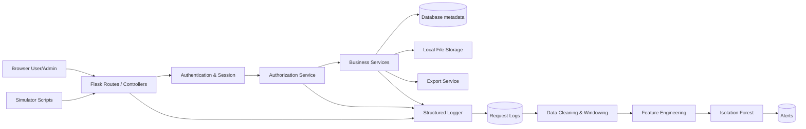

# 02. KIẾN TRÚC & THIẾT KẾ HỆ THỐNG (ARCHITECTURE & DESIGN)

## 1. Kiến trúc tổng thể
Hệ thống sử dụng Python Flask (Backend) kết hợp với Jinja2 + Bootstrap (Frontend). Dữ liệu được lưu tại MySQL/SQLite và file vật lý.



## 2. Cấu trúc thư mục (Project Structure)
```text
web-anomaly-detection/
├── app/                  # Package chính
│   ├── blueprints/       # Routes (auth, files, admin, alerts)
│   ├── models/           # SQLAlchemy models (user, folder, file, logs, alerts)
│   ├── services/         # Logic nghiệp vụ
│   ├── middleware/       # Structured request logging
│   ├── templates/        # Jinja2 views
│   └── static/           # CSS, JS, Images
├── ml/                   # Machine learning pipeline
├── scripts/              # Sinh dữ liệu, demo, export logs
├── data/                 # Data cho ML (raw, processed)
├── artifacts/            # Model đã huấn luyện, figures
├── docs/                 # Tài liệu dự án
├── tests/                # Unit tests / Integration tests
└── instance/             # Local database & Uploads
```

## 3. Danh sách API cốt lõi (API Matrix)
| Route | Actor/Permission | Input | Action log |
|---|---|---|---|
| `POST /login` | Public | email, password | LOGIN_SUCCESS/FAILED |
| `GET /dashboard` | USER | - | VIEW_DASHBOARD |
| `POST /api/folders` | USER | name, parent | CREATE_FOLDER |
| `POST /files/upload` | USER | file, folder_id | UPLOAD_FILE |
| `GET /files/{id}/download` | OWNER/VIEWER | file_id | DOWNLOAD_FILE |
| `POST /api/files/{id}/shares`| OWNER | email, VIEWER | SHARE_FILE |
| `POST /api/exports` | USER | type, file_ids | CREATE_EXPORT_JOB |
| `GET /admin/logs` | ADMIN | filters | ADMIN_VIEW_LOGS |
| `POST /admin/detection/run` | ADMIN | time range | RUN_DETECTION |
| `GET /admin/alerts` | ADMIN | filters | ADMIN_VIEW_ALERTS |

## 4. Giao diện (Wireframes cơ bản)
- **Login:** Form email, password, CSRF.
- **Dashboard:** Sidebar điều hướng, Header thống kê tệp, Danh sách hoạt động/tệp gần đây.
- **File Manager:** Bảng danh sách file có filter, sort. Menu tác vụ: Upload, Download, Share, Delete, Rename.
- **Admin Logs:** Bảng log request có công cụ lọc thời gian, user, status code. Cột thao tác xem chi tiết log.
- **Admin Alerts:** Danh sách cảnh báo có anomaly score. Link xem chi tiết trỏ về log gốc.

*(Xem chi tiết Wireframes trong file wireframes cũ)*
