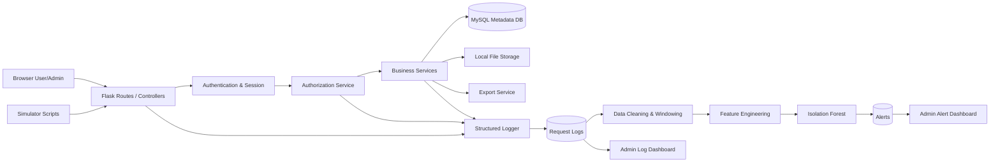
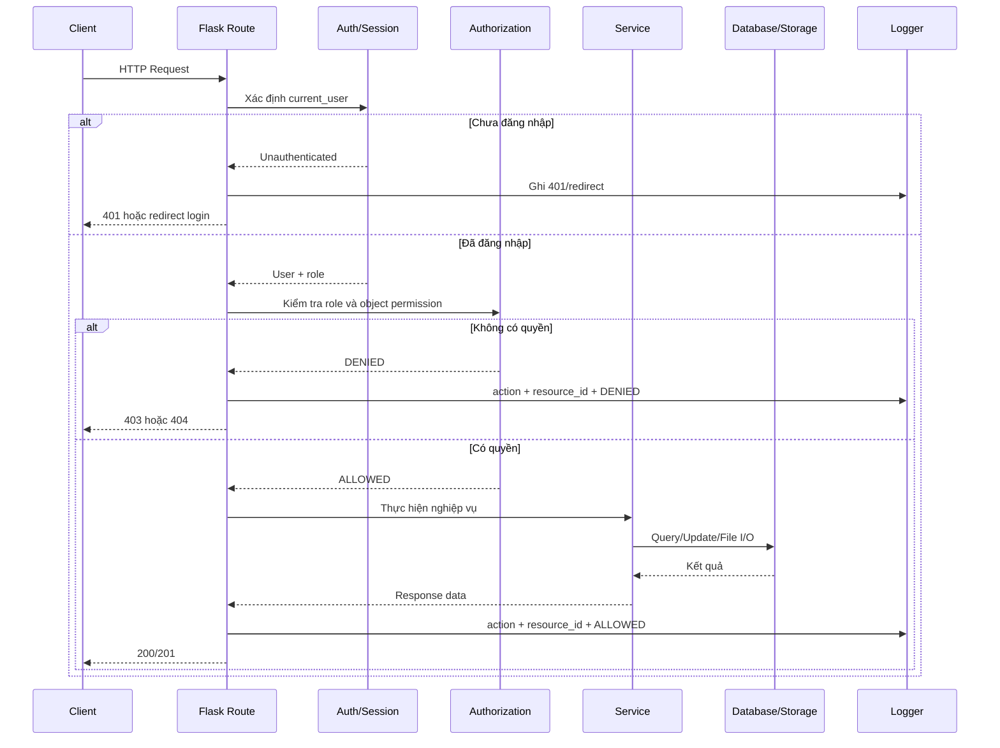
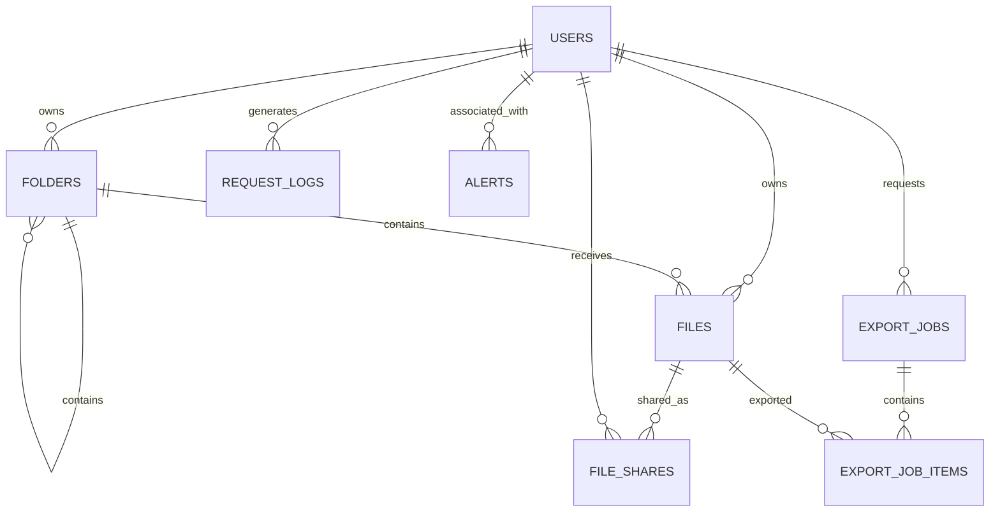

# ARCHITECTURE — KIẾN TRÚC HỆ THỐNG

## 1. Kiến trúc tổng thể



---

## 2. Luồng xử lý request



---

## 3. Thành phần

### 3.1. Presentation Layer

- Jinja2 templates.
- Bootstrap.
- Form có CSRF token.
- Hiển thị khác nhau theo role và permission.
- Không quyết định bảo mật chỉ bằng việc ẩn nút; server vẫn phải kiểm tra quyền.

### 3.2. Route/Controller Layer

Blueprint đề xuất:

```text
auth
dashboard
files
folders
shares
exports
admin
alerts
```

Nhiệm vụ:

- Nhận request.
- Validate input.
- Gọi authentication/authorization.
- Gọi service phù hợp.
- Trả response/status code.

### 3.3. Authentication & Session

- Xác minh password hash.
- Kiểm tra `is_active`.
- Tạo/xóa session.
- Cung cấp `current_user`.
- Ghi `session_id_hash` cho log, không ghi session token thô.

### 3.4. Authorization Service

Các hàm chính:

```text
can_view_file(user, file)
can_modify_file(user, file)
can_access_folder(user, folder)
can_download_export(user, export_job)
is_admin(user)
```

Authorization luôn chạy ở server trước khi service trả dữ liệu.

### 3.5. Business Services

```text
file_service
folder_service
share_service
export_service
log_service
detection_service
```

Service chịu trách nhiệm transaction và không trộn trực tiếp với HTML rendering.

### 3.6. MySQL Metadata Database

Database chính là MySQL, truy cập thông qua SQLAlchemy và driver PyMySQL.

Các bảng cốt lõi:

```text
users
folders
files
file_shares
export_jobs
export_job_items
request_logs
alerts
```

### 3.7. Local File Storage

- File vật lý đặt ngoài thư mục public/static.
- Tên lưu bằng UUID.
- Download thông qua route đã kiểm tra quyền.
- Không expose đường dẫn vật lý trong response.

### 3.8. Structured Logger

Ghi tối thiểu:

```text
timestamp
request_id
user_id
session_id_hash
ip_address
user_agent
http_method
endpoint
action
resource_type
resource_id
permission
authorization_result
status_code
response_time_ms
file_size
export_item_count
```

### 3.9. Data & ML Pipeline

```text
request_logs
→ clean/validate
→ group theo user + session + time window
→ feature engineering
→ Isolation Forest
→ anomaly score/prediction
→ alert
```

---

## 4. Quan hệ dữ liệu mức cao



---

## 5. Quy tắc status code

| Code | Sử dụng |
|---:|---|
| `200 OK` | GET thành công, update thành công, download thành công |
| `201 Created` | Tạo folder, upload file, tạo share, tạo export job |
| `204 No Content` | Hủy share hoặc delete thành công khi không cần body |
| `400 Bad Request` | Input thiếu/sai, file type không hợp lệ, ID không hợp lệ |
| `401 Unauthorized` | API yêu cầu đăng nhập nhưng chưa có session |
| `403 Forbidden` | Đã đăng nhập nhưng không có quyền |
| `404 Not Found` | Resource không tồn tại hoặc quy ước ẩn sự tồn tại |
| `409 Conflict` | Share trùng, tên folder trùng theo quy tắc, trạng thái không hợp lệ |
| `413 Payload Too Large` | File vượt 20 MB |
| `500 Internal Server Error` | Lỗi ngoài dự kiến |

---

## 6. Nguyên tắc an toàn

- Không lưu file người dùng trong `static/`.
- Không xây route download bằng đường dẫn client cung cấp.
- Không tin `file_id`, `folder_id`, `export_job_id` từ client nếu chưa authorization.
- Không log nội dung file hoặc credential.
- Không để Admin mặc định bypass quyền nội dung file.
- Không tạo lỗ hổng BOLA thật để demo; simulator chỉ tạo request trái quyền và server phải chặn.
