# USE CASES — STUDYDRIVE

## 1. Đánh giá sơ đồ hiện tại

Sơ đồ đã đúng hướng actor:

- User thực hiện nghiệp vụ lưu trữ và chia sẻ tệp.
- Admin quản lý tài khoản, metadata, request log, detection và alert.

Các điểm phải chỉnh:

1. Đổi `viewAminDashboard` thành `viewAdminDashboard`.
2. Không nối `exportFileMetadataCSV` với Admin.
3. User tạo export job CSV/ZIP; Admin chỉ export request log.
4. `login` và `logout` phải nối với cả User và Admin.
5. `viewProfile`, `updateProfile`, `changePassword` có thể nối với cả User và Admin.
6. `createExportJob`, `viewExportHistory`, `downloadExport`, sharing và permanent delete nên ghi nhãn M1 nếu cần cắt scope.
7. Không thêm `register` hoặc `forgetPassword` vào bản chính.

---

## 2. Actor và phạm vi

### User

- Authentication và profile.
- Dashboard cá nhân.
- Folder và file thuộc sở hữu.
- File được chia sẻ với quyền VIEWER.
- Export của chính mình.
- Trash và restore.

### Admin

- Authentication và profile.
- Dashboard quản trị.
- Quản lý user.
- Xem metadata file/folder.
- Quản lý request log.
- Chạy detection.
- Quản lý alert.

Admin không mặc định được xem/download nội dung file riêng tư.

---

## 3. Danh sách use case chuẩn

### User — M0

```text
login
logout
createFolder
viewFolder
uploadFile
viewFiles
viewFileDetails
downloadFile
createExportJobCSV
viewExportHistory
downloadExport
deleteFile
viewTrash
restoreFile
```

### User — M1

```text
viewDashboard
viewProfile
updateProfile
changePassword
searchFiles
filterFiles
renameFile
moveFile
shareFile
revokeFileShare
viewSharedFiles
createExportJobZIP
permanentDeleteFile
```

### Admin — M0

```text
login
logout
viewRequestLogs
viewRequestLogDetails
filterRequestLogs
exportRequestLogs
runAnomalyDetection
```

### Admin — M1

```text
viewAdminDashboard
viewProfile
updateProfile
changePassword
viewUsers
viewUserDetails
lockUser
unlockUser
viewFileMetadata
viewAlerts
viewAlertDetails
updateAlertStatus
```

---

## 4. PlantUML đề xuất

```plantuml
@startuml
left to right direction

actor User
actor Admin

rectangle "STUDYDRIVE — LƯU TRỮ VÀ CHIA SẺ TÀI LIỆU" {
  usecase "login" as UC_Login
  usecase "logout" as UC_Logout
  usecase "viewProfile [M1]" as UC_Profile
  usecase "updateProfile [M1]" as UC_UpdateProfile
  usecase "changePassword [M1]" as UC_ChangePassword

  usecase "viewDashboard [M1]" as UC_UserDashboard
  usecase "createFolder" as UC_CreateFolder
  usecase "viewFolder" as UC_ViewFolder
  usecase "uploadFile" as UC_Upload
  usecase "viewFiles" as UC_ViewFiles
  usecase "searchFiles [M1]" as UC_Search
  usecase "filterFiles [M1]" as UC_Filter
  usecase "viewFileDetails" as UC_FileDetail
  usecase "downloadFile" as UC_Download
  usecase "renameFile [M1]" as UC_Rename
  usecase "moveFile [M1]" as UC_Move
  usecase "shareFile [M1]" as UC_Share
  usecase "revokeFileShare [M1]" as UC_Revoke
  usecase "viewSharedFiles [M1]" as UC_Shared
  usecase "createExportJob" as UC_CreateExport
  usecase "viewExportHistory" as UC_ExportHistory
  usecase "downloadExport" as UC_DownloadExport
  usecase "deleteFile" as UC_Delete
  usecase "viewTrash" as UC_Trash
  usecase "restoreFile" as UC_Restore
  usecase "permanentDeleteFile [M1]" as UC_Permanent

  usecase "viewAdminDashboard [M1]" as UC_AdminDashboard
  usecase "viewUsers [M1]" as UC_ViewUsers
  usecase "viewUserDetails [M1]" as UC_UserDetail
  usecase "lockUser [M1]" as UC_Lock
  usecase "unlockUser [M1]" as UC_Unlock
  usecase "viewFileMetadata [M1]" as UC_Metadata
  usecase "viewRequestLogs" as UC_Logs
  usecase "viewRequestLogDetails" as UC_LogDetail
  usecase "filterRequestLogs" as UC_FilterLogs
  usecase "exportRequestLogs" as UC_ExportLogs
  usecase "runAnomalyDetection" as UC_Detect
  usecase "viewAlerts [M1]" as UC_Alerts
  usecase "viewAlertDetails [M1]" as UC_AlertDetail
  usecase "updateAlertStatus [M1]" as UC_AlertStatus
}

User -- UC_Login
User -- UC_Logout
User -- UC_Profile
User -- UC_UpdateProfile
User -- UC_ChangePassword
User -- UC_UserDashboard
User -- UC_CreateFolder
User -- UC_ViewFolder
User -- UC_Upload
User -- UC_ViewFiles
User -- UC_Search
User -- UC_Filter
User -- UC_FileDetail
User -- UC_Download
User -- UC_Rename
User -- UC_Move
User -- UC_Share
User -- UC_Revoke
User -- UC_Shared
User -- UC_CreateExport
User -- UC_ExportHistory
User -- UC_DownloadExport
User -- UC_Delete
User -- UC_Trash
User -- UC_Restore
User -- UC_Permanent

Admin -- UC_Login
Admin -- UC_Logout
Admin -- UC_Profile
Admin -- UC_UpdateProfile
Admin -- UC_ChangePassword
Admin -- UC_AdminDashboard
Admin -- UC_ViewUsers
Admin -- UC_UserDetail
Admin -- UC_Lock
Admin -- UC_Unlock
Admin -- UC_Metadata
Admin -- UC_Logs
Admin -- UC_LogDetail
Admin -- UC_FilterLogs
Admin -- UC_ExportLogs
Admin -- UC_Detect
Admin -- UC_Alerts
Admin -- UC_AlertDetail
Admin -- UC_AlertStatus
@enduml
```



`createExportJob` xử lý CSV ở M0; ZIP chỉ được bật khi M1 hoàn thành.
