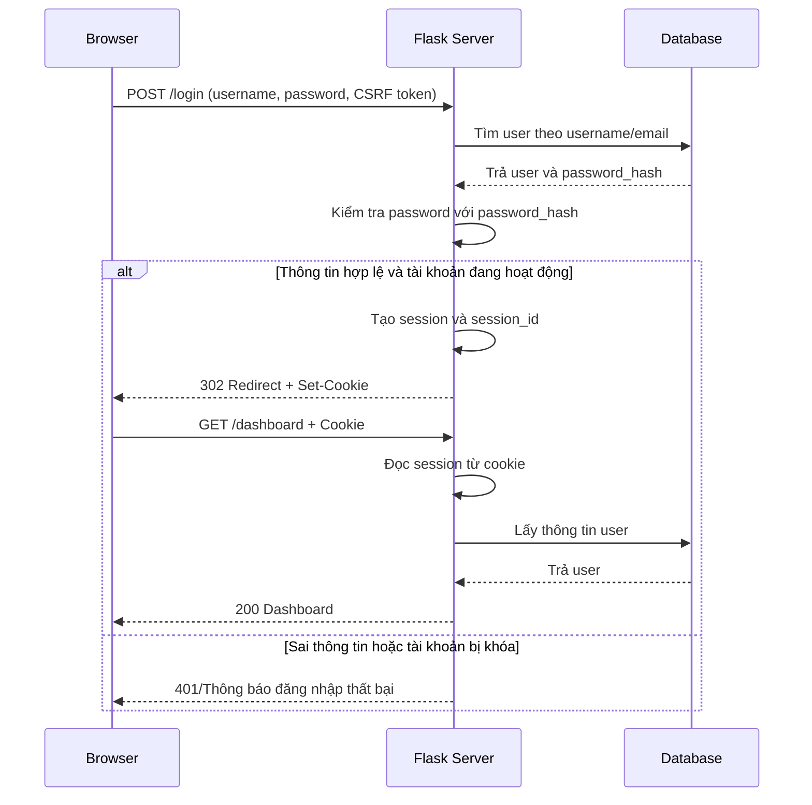

# WEB SECURITY NOTES

## 1. Mục tiêu

Tài liệu này tổng hợp các kiến thức Web Security cần dùng trực tiếp cho hệ thống lưu trữ và chia sẻ tài liệu trực tuyến. Sau khi học xong, cần giải thích được:

- Authentication là gì và khác Authorization như thế nào.
- Session và cookie phối hợp ra sao để duy trì trạng thái đăng nhập.
- Vì sao người dùng đăng nhập đúng vẫn không được xem mọi tệp.
- Các thuộc tính cookie `HttpOnly`, `Secure`, `SameSite` có vai trò gì.
- CSRF token bảo vệ các form thay đổi dữ liệu như thế nào.
- BOLA/IDOR xảy ra khi nào và server phải kiểm tra quyền ở cấp đối tượng ra sao.
- Log cần ghi những tín hiệu nào để nhận diện hành vi dò quét BOLA.

---

## 2. Flow đăng nhập, session và cookie

### 2.1. Luồng tổng quát



### 2.2. Giải thích từng bước

1. Người dùng nhập email hoặc username và mật khẩu vào form đăng nhập.
2. Browser gửi credential đến server bằng request `POST /login`.
3. Server tìm tài khoản trong database.
4. Server không so sánh với mật khẩu plaintext. Mật khẩu nhập vào được kiểm tra với `password_hash`.
5. Nếu hợp lệ, server tạo trạng thái đăng nhập cho người dùng trong session.
6. Server gửi cookie về browser. Cookie chứa giá trị nhận diện session hoặc dữ liệu session đã được ký, tùy cách cấu hình.
7. Ở các request tiếp theo, browser tự động gửi cookie phù hợp về server.
8. Server đọc session để biết request đang thuộc về user nào.
9. Sau khi xác định user, server vẫn phải kiểm tra quyền đối với từng route và từng tài nguyên.

### 2.3. Điều quan trọng

Đăng nhập chỉ giúp server trả lời câu hỏi:

> “Người gửi request là ai?”

Nó chưa trả lời câu hỏi:

> “Người này có được phép thực hiện hành động này trên tệp cụ thể hay không?”

Câu hỏi thứ hai phải được giải quyết bằng Authorization.

---

## 3. Authentication và Authorization

### 3.1. Authentication

Authentication là quá trình xác minh danh tính của người dùng.

Ví dụ:

- Người dùng gửi email và mật khẩu.
- Server kiểm tra thông tin.
- Nếu đúng, server xác định đây là User A.
- Session được tạo để các request sau tiếp tục được nhận diện là User A.

Authentication trả lời:

> “Bạn là ai?”

### 3.2. Authorization

Authorization là quá trình kiểm tra người dùng đã xác thực có được phép thực hiện một hành động cụ thể hay không.

Authorization trả lời:

> “Bạn được phép làm gì?”

Trong hệ thống này có hai lớp quyền:

#### Quyền cấp hệ thống

- `USER`: sử dụng các chức năng lưu trữ và chia sẻ tệp cá nhân.
- `ADMIN`: quản lý tài khoản, log và cảnh báo.

#### Quyền cấp tệp

- `OWNER`: chủ sở hữu tệp.
- `VIEWER`: người được chủ sở hữu chia sẻ tệp với quyền xem/tải.
- `NONE`: không sở hữu và không được chia sẻ.

### 3.3. Ví dụ owner/viewer

Giả sử:

```text
User A sở hữu file_id = 101
User A chia sẻ file 101 cho User B với quyền VIEWER
User C không liên quan đến file 101
```

| Hành động | User A – OWNER | User B – VIEWER | User C – NONE |
|---|---:|---:|---:|
| Xem thông tin tệp | Có | Có | Không |
| Tải tệp | Có | Có | Không |
| Đổi tên tệp | Có | Không | Không |
| Di chuyển tệp | Có | Không | Không |
| Chia sẻ tệp | Có | Không | Không |
| Xóa tệp | Có | Không | Không |
| Khôi phục tệp | Có | Không | Không |

User B có thể đăng nhập thành công nhưng vẫn không được xóa hoặc đổi tên file 101. User C cũng đăng nhập thành công nhưng không được xem nội dung file 101.

---

## 4. Session và cookie

### 4.1. Session

Session là dữ liệu phía server hoặc dữ liệu được server ký để ghi nhớ trạng thái của một người dùng giữa nhiều request.

Session thường lưu các thông tin tối thiểu như:

```text
user_id
role
login_time
session_identifier
```

Không nên lưu mật khẩu hoặc dữ liệu nhạy cảm không cần thiết trong session.

### 4.2. Cookie

Cookie là dữ liệu nhỏ được server gửi về browser. Browser lưu cookie và tự động gửi lại trong các request phù hợp.

Trong luồng đăng nhập:

```text
Session giúp server nhớ trạng thái.
Cookie giúp browser mang thông tin nhận diện session quay lại server.
```

### 4.3. Các thuộc tính cookie quan trọng

#### `HttpOnly`

Cookie có `HttpOnly` không thể được đọc trực tiếp bằng JavaScript phía trình duyệt.

Mục đích:

- Giảm nguy cơ mã JavaScript độc hại đọc cookie session.
- Hạn chế hậu quả khi có lỗ hổng XSS.

`HttpOnly` không ngăn browser gửi cookie theo request. Nó chỉ hạn chế truy cập từ JavaScript.

#### `Secure`

Cookie có `Secure` chỉ được gửi qua kết nối HTTPS.

Mục đích:

- Tránh gửi cookie session qua HTTP không mã hóa.
- Giảm nguy cơ cookie bị lộ trên đường truyền.

Khi chạy local bằng HTTP, cấu hình development có thể khác production. Không nên vì môi trường local mà bỏ quên yêu cầu `Secure` khi triển khai thật.

#### `SameSite`

`SameSite` kiểm soát việc browser gửi cookie trong các request bắt nguồn từ website khác.

Các mức thường gặp:

- `Strict`: hạn chế mạnh request từ site khác.
- `Lax`: cho phép một số điều hướng cấp cao nhưng hạn chế nhiều request cross-site.
- `None`: cho phép gửi cross-site và phải kết hợp `Secure`.

`SameSite` giúp giảm nguy cơ CSRF nhưng không nên xem là thay thế hoàn toàn CSRF token.

---

## 5. CSRF và CSRF token

### 5.1. CSRF là gì?

CSRF xảy ra khi người dùng đang đăng nhập vào hệ thống nhưng bị một website khác dụ gửi request thay đổi dữ liệu đến hệ thống đó.

Ví dụ:

1. User A đang đăng nhập vào hệ thống.
2. Browser đang giữ cookie session của User A.
3. User A mở một website độc hại.
4. Website độc hại tạo request xóa tệp đến hệ thống.
5. Browser có thể tự động gửi cookie session kèm request.
6. Nếu server chỉ dựa vào cookie mà không kiểm tra CSRF token, request có thể bị xử lý dưới danh nghĩa User A.

### 5.2. Vai trò của CSRF token

CSRF token là một giá trị khó đoán được server tạo và gắn vào form hợp lệ.

```html
<form method="POST" action="/files/101/delete">
    <input type="hidden" name="csrf_token" value="...">
    <button type="submit">Xóa tệp</button>
</form>
```

Khi nhận request, server kiểm tra:

```text
Cookie/session hợp lệ
VÀ
CSRF token hợp lệ
VÀ
User có quyền với file_id
```

Nếu thiếu một trong ba điều kiện, request phải bị từ chối.

### 5.3. Các form cần CSRF token

- Đăng nhập.
- Upload tệp.
- Tạo thư mục.
- Đổi tên tệp.
- Di chuyển tệp.
- Chia sẻ hoặc hủy chia sẻ tệp.
- Export nếu request tạo `export_job`.
- Xóa, khôi phục hoặc xóa vĩnh viễn.
- Đổi mật khẩu.
- Khóa hoặc mở tài khoản.

---

## 6. Kiểm tra quyền cấp đối tượng

### 6.1. Quyền cấp route chưa đủ

Chỉ dùng `login_required` chưa đủ vì decorator này chỉ kiểm tra user đã đăng nhập.

Ví dụ:

```http
GET /api/files/101
```

Server phải kiểm tra cả hai bước:

1. User đã đăng nhập chưa?
2. User có quyền với `file_id = 101` không?

### 6.2. Quy tắc truy cập tệp

Một user được xem hoặc tải tệp khi:

```text
file.owner_id == current_user.id
HOẶC
tồn tại file_share(file_id, current_user.id, permission = VIEWER)
```

Một user được sửa, chia sẻ, xóa hoặc khôi phục tệp khi:

```text
file.owner_id == current_user.id
```

Admin không nên tự động được xem nội dung mọi tệp chỉ vì có role `ADMIN`. Trong phạm vi đề tài, Admin chủ yếu quản lý tài khoản, metadata, log và cảnh báo.

### 6.3. Pseudocode kiểm tra quyền

```python
def can_view_file(user, file):
    if file.owner_id == user.id:
        return True

    return FileShare.query.filter_by(
        file_id=file.id,
        shared_with_user_id=user.id,
        permission="VIEWER",
    ).first() is not None


def can_modify_file(user, file):
    return file.owner_id == user.id
```

---

## 7. BOLA/IDOR trong hệ thống tệp

### 7.1. BOLA là gì?

BOLA xảy ra khi ứng dụng nhận một ID tài nguyên từ client nhưng không kiểm tra đầy đủ quyền của user hiện tại đối với tài nguyên đó.

Ví dụ User B được xem file 101. User B thử đổi URL:

```http
GET /api/files/102
GET /api/files/103
GET /api/files/104
```

Nếu server chỉ lấy tệp theo ID và trả dữ liệu mà không kiểm tra owner/share, User B có thể xem tệp của người khác.

### 7.2. Cách xử lý đúng

Mỗi request dùng `file_id`, `folder_id` hoặc `export_job_id` phải kiểm tra quyền cấp đối tượng.

```text
Bước 1: Tìm tài nguyên theo ID.
Bước 2: Xác định current_user.
Bước 3: Kiểm tra current_user là OWNER hay VIEWER.
Bước 4: Kiểm tra hành động có phù hợp với permission không.
Bước 5: Trả dữ liệu hoặc từ chối.
```

Kết quả có thể là:

- `200`: được phép.
- `403`: đã xác định tài nguyên nhưng user không có quyền.
- `404`: không tồn tại hoặc hệ thống cố tình không tiết lộ tài nguyên có tồn tại.

Dù chọn `403` hay `404`, hệ thống phải dùng nhất quán và không được trả nội dung tệp khi không có quyền.

### 7.3. Các endpoint cần kiểm tra kỹ

```text
GET    /api/files/{file_id}
GET    /api/files/{file_id}/download
PUT    /api/files/{file_id}
DELETE /api/files/{file_id}

GET    /api/folders/{folder_id}
PUT    /api/folders/{folder_id}
DELETE /api/folders/{folder_id}

GET    /api/exports/{export_job_id}
GET    /api/exports/{export_job_id}/download
```

---

## 8. Tín hiệu log của BOLA Scan

Một request truy cập trái quyền chưa chắc là hành vi tấn công. Người dùng có thể mở nhầm liên kết hoặc tệp vừa bị hủy chia sẻ. Vì vậy cần quan sát hành vi theo chuỗi request.

### 8.1. Nhiều ID khác nhau

```text
file_id: 101, 102, 103, 104, 105
```

Feature liên quan:

```text
unique_resource_id_count
resource_id_change_rate
unique_failed_resource_id_count
```

### 8.2. Nhiều lần permission denied

```text
permission = NONE
authorization_result = DENIED
```

Feature liên quan:

```text
authorization_denied_count
ownership_mismatch_rate
```

### 8.3. Tỷ lệ 403/404 cao

Feature liên quan:

```text
forbidden_count
forbidden_rate
not_found_count
not_found_rate
error_rate
```

### 8.4. ID thay đổi tuần tự

```text
/api/files/200
/api/files/201
/api/files/202
/api/files/203
```

Đây là dấu hiệu có thể liên quan đến script dò ID. Tuy nhiên, không nên chỉ dựa vào tính tuần tự vì ID hợp lệ cũng có thể gần nhau.

### 8.5. Low-and-slow

Kẻ dò quét có thể không gửi request quá nhanh mà giãn cách để tránh rate limiting.

```text
1 request mỗi 10–30 giây
nhưng kéo dài qua nhiều phút
và thử nhiều file_id khác nhau
```

Vì vậy hệ thống cần kết hợp:

- Số ID khác nhau.
- Tỷ lệ denied.
- Tỷ lệ 403/404.
- Thời lượng session.
- Số endpoint có ID.
- Mức độ khác biệt so với hành vi bình thường.

### 8.6. Trường log tối thiểu

```text
timestamp
user_id
session_id_hash
ip_address
user_agent
http_method
endpoint
action
resource_type
resource_id
permission
authorization_result
status_code
response_time_ms
```

Không ghi password, cookie nguyên bản, session token nguyên bản hoặc nội dung tệp nhạy cảm.

---

## 9. Ví dụ tổng hợp

User B đăng nhập thành công và đang giữ session hợp lệ.

User B được chia sẻ file 101 với quyền `VIEWER`:

```http
GET /api/files/101
→ 200 OK
```

User B thử xem file 102 không được chia sẻ:

```http
GET /api/files/102
→ 403 Forbidden
```

User B thử xóa file 101:

```http
DELETE /api/files/101
→ 403 Forbidden
```

Giải thích:

- Authentication thành công: hệ thống biết đây là User B.
- Authorization xem file 101 thành công: User B là `VIEWER`.
- Authorization xem file 102 thất bại: User B có permission `NONE`.
- Authorization xóa file 101 thất bại: chỉ `OWNER` được xóa.

Nếu User B tiếp tục thử hàng chục `file_id`, log có thể cho thấy hành vi BOLA Scan.

---

## 10. Mười câu tự kiểm tra

### Câu 1
**Authentication trả lời câu hỏi gì?**

Authentication trả lời “Người gửi request là ai?” bằng cách xác minh credential hoặc trạng thái đăng nhập.

### Câu 2
**Authorization trả lời câu hỏi gì?**

Authorization trả lời “Người dùng đã xác thực được phép thực hiện hành động nào trên tài nguyên cụ thể nào?”

### Câu 3
**Tại sao đăng nhập thành công vẫn không được xem mọi tệp?**

Vì đăng nhập chỉ xác minh danh tính. Mỗi tệp có chủ sở hữu và danh sách chia sẻ riêng. Server phải kiểm tra user là `OWNER` hoặc `VIEWER` trước khi trả dữ liệu.

### Câu 4
**Session và cookie khác nhau như thế nào?**

Session lưu hoặc đại diện cho trạng thái đăng nhập. Cookie là cơ chế browser lưu và gửi thông tin nhận diện session về server ở các request tiếp theo.

### Câu 5
**`HttpOnly` có tác dụng gì?**

`HttpOnly` hạn chế JavaScript đọc cookie, qua đó giảm nguy cơ cookie session bị lấy trực tiếp bởi mã script độc hại.

### Câu 6
**`Secure` có tác dụng gì?**

`Secure` yêu cầu cookie chỉ được gửi qua HTTPS, tránh truyền cookie qua HTTP không mã hóa.

### Câu 7
**`SameSite` có thay thế hoàn toàn CSRF token không?**

Không. `SameSite` giúp hạn chế gửi cookie trong một số request cross-site, nhưng các form thay đổi dữ liệu vẫn nên được bảo vệ bằng CSRF token.

### Câu 8
**CSRF token bảo vệ request như thế nào?**

Server tạo token khó đoán cho form hợp lệ. Khi nhận request thay đổi dữ liệu, server chỉ xử lý nếu token gửi lên khớp với token gắn với session.

### Câu 9
**BOLA xảy ra khi nào?**

BOLA xảy ra khi server nhận `file_id`, `folder_id` hoặc ID tài nguyên khác nhưng không kiểm tra user hiện tại có quyền với đối tượng đó trước khi trả dữ liệu hoặc thực hiện hành động.

### Câu 10
**Các tín hiệu chính của BOLA Scan là gì?**

Nhiều resource ID khác nhau, tỷ lệ permission denied cao, nhiều response 403/404, ID thay đổi tuần tự và hành vi low-and-slow trong cùng user/session hoặc cửa sổ thời gian.

---

## 11. Checklist hoàn thành

- [ ] Vẽ và giải thích được flow credential → xác thực → session → cookie → request tiếp theo.
- [ ] Phân biệt được Authentication và Authorization.
- [ ] Giải thích được quyền `OWNER`, `VIEWER`, `NONE`.
- [ ] Nêu đúng vai trò của `HttpOnly`, `Secure`, `SameSite`.
- [ ] Giải thích được CSRF và CSRF token.
- [ ] Viết được pseudocode kiểm tra owner/share.
- [ ] Mô tả được BOLA theo `file_id`.
- [ ] Nêu được tín hiệu nhiều ID, permission denied, 403/404 và low-and-slow.
- [ ] Trả lời được 10 câu tự kiểm tra mà không nhìn tài liệu.
- [ ] Giải thích được câu: “Đăng nhập đúng không đồng nghĩa có quyền xem mọi tệp.”
